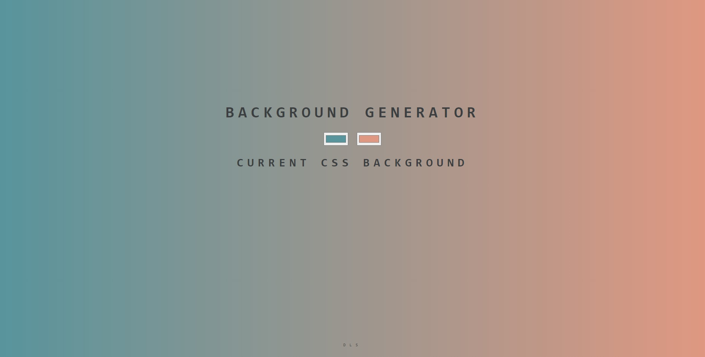

## My cool Gradient-Generator for Backgrounds!
### Left to do list (suggestions are accepted)
- [X] Print in the screen the rgb colors you are using, everytime it's being updated.
- [ ] Add a `button` that allows us to copy the RGB colors.
- [ ] Add a `button` that randomly change the both side colors.
- [X] Add a `button` that randomly change the left side color. Update the printed rgb. Update the color displayed on the input
- [X] Add a `button` that randomly change the right side color. Update the printed rgb. Update the color displayed on the input

Check the results [here !](https://gradient-generator.diegolajus.vercel.app/) 

*last update 27/12*

